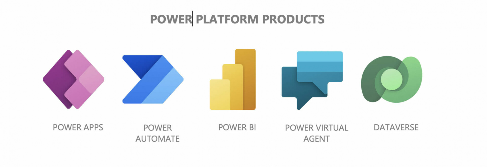

# 🌐 **IF IntegrandFronteras** 

**IF IntegrandFronteras** es la empresa líder en integración tecnológica que conecta sedes empresariales en todo el país, Latinoamérica y Europa. Nos especializamos en crear soluciones innovadoras que eliminan fronteras y mejoran la colaboración entre todas las operaciones de nuestro grupo empresarial.

---

## 🚀 **Tecnologías Utilizadas**

En **IF IntegrandFronteras**, utilizamos una amplia gama de herramientas tecnológicas que nos permiten automatizar procesos, crear aplicaciones personalizadas, y analizar datos para la toma de decisiones estratégicas. Las principales tecnologías que utilizamos incluyen:

- **Microsoft Power Platform**: Potente conjunto de herramientas que incluye Power Apps, Power Automate, Power BI, y Power Virtual Agents para desarrollar aplicaciones, automatizar procesos y crear soluciones basadas en datos.
- **Power Apps Copilot**: Utilizamos inteligencia artificial para generar aplicaciones de forma asistida, optimizando los tiempos de desarrollo.
- **Lenguajes de Programación**: JavaScript, Python, SQL, y TypeScript, usados para desarrollar aplicaciones dinámicas, gestionar bases de datos y realizar análisis complejos.
- **Frameworks y Librerías**: React, Node.js ,CSS , que nos permiten crear aplicaciones robustas y responsivas, mejorando la experiencia del usuario.

---

## 🌍 **Nuestra Misión**

Conectar y potenciar empresas globalmente, eliminando fronteras tecnológicas y geográficas mediante soluciones innovadoras y personalizadas que impulsan la eficiencia y la colaboración.

---

## 📞 **Contáctanos**

- **Sitio Web**: [www.ifintegrandfronteras.com](https://www.gocsa.es/)
- **LinkedIn**: [IF IntegrandFronteras](https://www.linkedin.com/company/g.o.c.-s-a/mycompany/)

---

